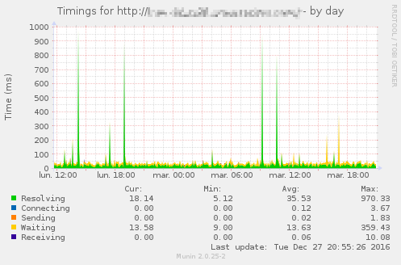
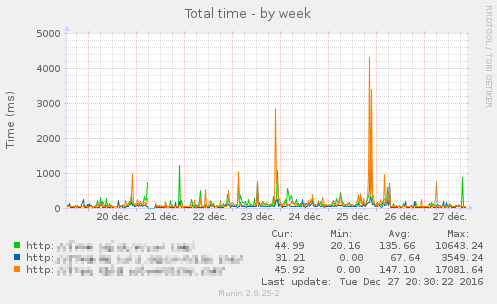

# munin-http-timing [](https://travis-ci.org/DigitalBackstage/munin-http-timing)
munin-node plugin to get detailed HTTP response timing information from
requesting an URI.

<a href="example_detail.png" ></a>
<a href="example_multi.png" ></a>

## Usage
Build using `make release`, link the executable from `releases/` in
`/etc/munin/plugins/`, configure it in `/etc/munin/plugin-conf.d/` and restart
the `munin-node` service.  
Two binaries are provided, one for _ARMv6_ (Raspberry-Pi compatible) and one
for AMD64.

## Configuration
URIs must be registered in the environment variables using variables named
`TARGET_<name>`.

Example:
```
[http-timing]
env.TARGET_EXAMPLE https://example.com/
env.TARGET_GITHUB https://github.com/L-P
```

Other options:

- `env.RANDOM_DELAY` (default to `0`) when set to `1` requests will be delayed
  by a random amount. This is useful when you test many URIs on the same
  server and don't want to have them arrive at the same time.
- `env.USER_AGENT` (default to `http-timing/version`) `User-Agent` header to
  send when making the HTTP requests.

## Tests
```bash
# run test suite
make test

# get code coverage and display it in browser
make cover
```

## License
[MIT](LICENSE)
